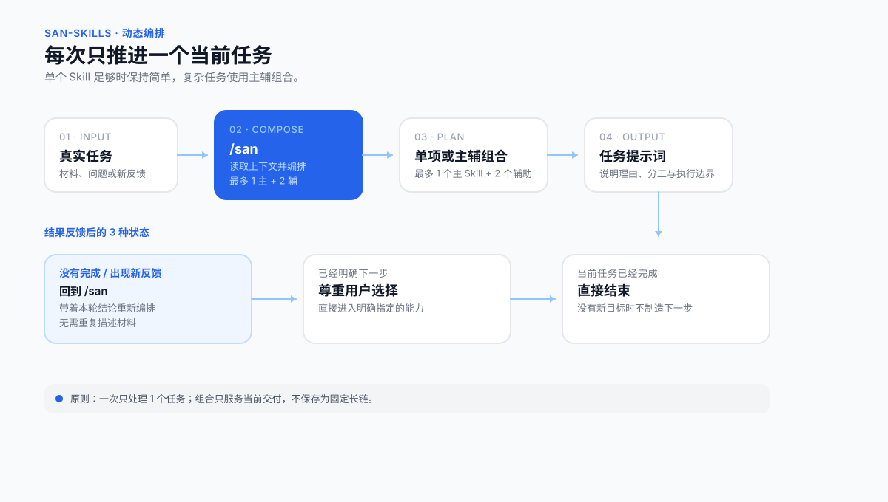

# san-skills

> 面向一人公司创业者与内容创作者的中文 AI Skills 工具箱。把真实业务、内容与行动问题交给 Agent，获得清晰判断和可以立刻执行的下一步。

[](VERSION)
[](https://skills.sh/sansan19900801/san-skills)
[](LICENSE)

**支持：豆包 Agent Plan、Codex、WorkBuddy，以及其他支持 Skills 的 Agent。**

san-skills 由 [三三](https://github.com/sansan19900801) 创建。从一人公司实战经验中筛选、结构化出的方法论，沉淀为 32 个可直接调用的 Skills。

**v0.1.0 更新：** 首版发布，32 个 Skill 全部就位，覆盖商业诊断、内容创作、行动方法、知识管理四大类。

[快速开始](#快速开始) · [安装](#安装) · [能力一览](#能力一览) · [完整使用手册](docs/新手入门.md) · [更新记录](https://github.com/sansan19900801/san-skills/commits/main)




## san-skills 解决什么问题

你不需要先学会一套复杂的方法，也不需要知道该调用哪个工具。把当下的业务、内容、选择或卡点交给 `/san`，它会根据对话上下文判断单个 Skill 是否足够；复杂任务可以编排 1 个主 Skill 和最多 2 个辅助 Skill。

| 真实处境 | 你会得到 |
| --- | --- |
| 客户总说贵，不知道该改价格、产品还是客群 | 商业模式诊断、风险判断和验证动作 |
| 有一个选题，却做不出能被人看完的内容 | 内容方向、开头、标题与逐字稿优化 |
| 知道该做什么，却迟迟推不动 | 对行动卡点的分析和一条可开始的动作 |
| 反复面对同类选择，经验无法积累 | 可回填的决策记录、规律与阶段快照 |
| 文稿、选题、案例散落在多个文件夹 | 可持续维护的内容资产工程 |
| 本地资料很多，希望 Agent 能稳定查找和调用 | 基于文件夹的知识库导航、版本规则与使用入口 |

## 快速开始

安装完成后，直接在 Agent 中输入：

```text
/san 我做宝妈收纳咨询，客户总觉得贵。我需要判断问题出在产品、定价，还是我找错了客户。
```

`/san` 会读取当前对话信息，说明推荐理由，并生成一段可以直接继续发送的提示词。完成一轮后，继续补充新的事实或反馈，再输入 `/san`，它会重新判断当前任务需要单项还是组合。

已经知道需求时，可以直接调用具体 Skill：

```text
/san-diagnosis 我做面向宝妈的收纳咨询，客户总觉得贵。我该调整什么？
/san-content 我想讲"普通人别急着做个人IP"，这个选题怎样做成内容？
/san-hook 这是我短视频前20秒的逐字稿，帮我优化开头：……
/san-benchmark 我想研究企业服务内容账号，应该找哪些对标？
/san-knowledge 帮我把这个文件夹变成知识库，以后我想直接从里面找资料。
```

## 能力一览

| 工作目标 | 主要入口 | 常见产出 |
| --- | --- | --- |
| 判断生意、产品、定价与客户 | `/san-diagnosis` | 商业诊断、风险、验证方案 |
| 找对标并提炼可学习的部分 | `/san-benchmark` | 对标筛选与研究框架 |
| 先挖掘相关领域、作者和可信理论，再研究历史同构答案 | `/san-standard-answer` | 理论锚点、案例矩阵、条件性答案与失效边界 |
| 做选题、内容、标题与短视频 | `/san-content`、`/san-hook`、`/san-xhs-title` | 内容方向与可发布文案 |
| 发布前检查敏感词、导流、广告与受限内容 | `/san-content-risk-check` | 风险检测与最小修改动作 |
| 检查文稿共鸣、逻辑与传播性 | `/san-resonate`、`/san-script-flow`、`/san-spread` | 修改意见与优先级 |
| 澄清概念、目标和问题 | `/san-deconstruct`、`/san-goal`、`/san-good-question` | 可验证的定义与行动目标 |
| 处理拖延和行动受阻 | `/san-action` | 卡点分析与下一步动作 |
| 记录、复盘长期决策 | `/san-decision`、`/san-save`、`/san-restore`、`/san-report` | 决策档案与报告 |
| 建立和治理文件夹知识库 | `/san-knowledge` | 知识库导航、版本规则、健康检查 |
| 建立内容资产与多端 Agent 工作台 | `/san-content-system`、`/san-agent-migration`、`/san-install-skill` | 本地工程、主题地图与安装方案 |
| 把反复问题制作成单个 Skill | `/san-skill-maker` | 可安装 Skill、分级验证结果与可选 GitHub 发布 |

完整的 32 个 Skill、适用时机、输入示例和动态导航方式，见 [新手入门与 Skill 全目录](docs/新手入门.md)。

## 安装

### 推荐：豆包、Codex、WorkBuddy 与其他支持 Skills 的 Agent

在终端执行：

```bash
npx -y skills add sansan19900801/san-skills -g --all
```

安装后回到 Agent，输入 `/san 新手入门` 即可开始。

### 更新

已安装 san-skills 时，直接对当前 Agent 说：

```text
更新 san-skills
```

它会同步官方版本，不会修改你在本地的存档、报告和决策记录。版本变化见 [提交记录](https://github.com/sansan19900801/san-skills/commits/main)。

## san-skills 怎样工作

```text
真实任务
   ↓
/san 读取上下文并判断单项或组合
   ↓
生成一段可直接继续发送的提示词
   ↓
入选 Skill 交付一份统一结果
   ↓
补充结果与反馈，再重新编排
```

san-skills 每次只处理一个当前任务。单个 Skill 能覆盖时保持简单；任务包含独立且必要的要求时，使用主辅组合共同交付一份结果。

## 设计原则

1. **总控路由，不用记命令** — 装了总控 `/san` 之后，用自然语言说就行，它自己判断调哪个
2. **单任务原则** — 每次只处理一件事，不贪多
3. **组合最多 1+2** — 一个主 Skill + 最多两个辅助 Skill，够用就好
4. **先诊断后开方** — 先搞清楚问题，再给方案，不上来就给答案
5. **行动导向** — 每个 Skill 的输出都要有"下一步可以做什么"

## 作者与支持

作者：[三三](https://github.com/sansan19900801)

## 许可证

本项目采用 [CC BY-NC 4.0](LICENSE) 许可证。

- 个人使用、学习、研究与非商业项目可以直接使用。
- 公开发布衍生作品时，请注明来源。
- 商业用途需要单独授权，请联系作者。
